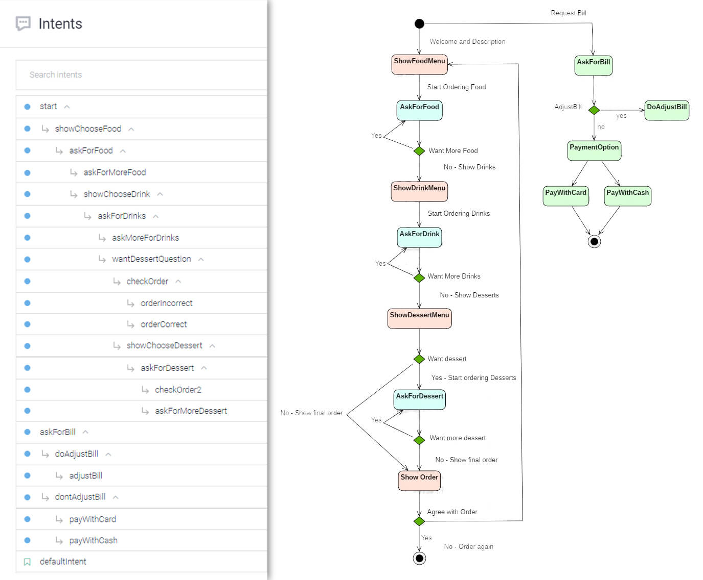

# RestBot - A Bot designed for Restaurants

## Abstract
Implementation of a Chatbot in an android app, by using two main technologies:
 - [Dialoflow](https://dialogflow.com/) Google platform, that allow us to develop human-computer interaction technologies based on natural language conversations.
 - [Firebase](https://firebase.google.com/). The module database is implemented in the application in order to connect a remote database in Firebase with the different menu´s entities in Dialogflow. Besides,
 a limitation in Dialogflow is that we can not have attributes in the entries of an entity, so we store our full database in firebase and update the Dialogflow one in real-time.

The developed chatbot is designed for restaurants, with the aim of improving the experience of a customer that decides to eat in the restaurant. It is thought to be installed in a tablet on each
table of the restaurant. When a customer sits in the table, the tablet is waiting with a welcome message, and the conversation start.

There are two possible input ways of interaction with the chatbot, the first one would be writing in the tablet, without any sound. The second one would be by voice, the customer press a button to speak
and the chatbot will read everything that it displays out loud, easing the process for people with disabilities.

The main features of the chatbot are:
  * Possibility of interaction by voice and text.
  * Read remote database from Firebase.
  * Update the Dialogflow entities with the ones saved in the firebase database in real-time.
  * Show menus of Food, Drinks and Desserts during conversation. If a dish is removed or changed in the firebase database, it would be removed in real-time in the menus.
  * Make suggestions with certain kind of food. For example, if some dish that contains meat is ordered, red wine will be recommended.
  * Allow the possibility of not asking for dessert.
  * Show prices in the menu, by relating Dialogflow entities with firebase database.
  * Calculate the bill and possibility of diving it between the people in the table.
  * Send the order once is finished to the firabase database, where a TPV could read it from.
  * Allow to pay by card or cash. (real payment not implemented)

## State Diagram of process
<kbd>
  
</kbd>
<!--  -->

## Bibliography
  - [Android SDK for Dialogflow](https://github.com/dialogflow/dialogflow-android-client)
  - [Android chatbot with Dialogflow](https://medium.com/@abhi007tyagi/android-chatbot-with-dialogflow-8c0dcc8d8018)
  - [Entities management in Dialogflow](https://dialogflow.com/docs/reference/agent/entities#put_entities_sample)
  - [Read and Write - Firebase](https://firebase.google.com/docs/database/android/read-and-write)
  - [Saving Data - Firebase](https://firebase.google.com/docs/database/admin/save-data)
